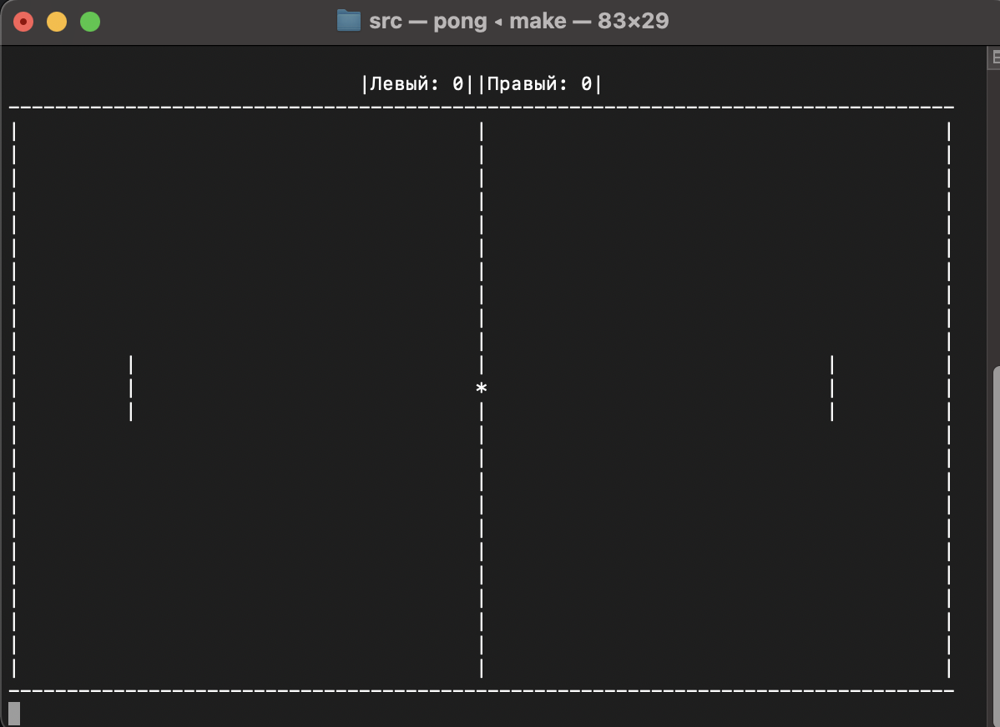

# c-pong-game

Console turn-based Ping Pong game  
*Project date: 08-2022*

***== The program src/pong.c is a training project to reinforce the skills of structural programming in C, namely a game for two 
similar to the game "Pong". Only the character (ASCII) graphics are used to display 
graphics (with output to the terminal). The game is implemented as a step-by-step game in the standard <stdio.h> library.***

* ***Keys***:

***A/Z and K/M - to move the rackets;***

***Space Bar - to skip an action at a certain step of the game in step-by-step mode.***

* ***Graphics***

***The field is a 80 x 25-symbol rectangle.*** 

***Racket size is 3 symbols;*** 

***Ball size is 1 symbol.***

* ***UI/UX***

***When one of the players scores 21 points, congratulations to the winner are displayed on the screen and the game ends.==***

### Project build

The project is build through a Makefile in the src folder with the command *make*
